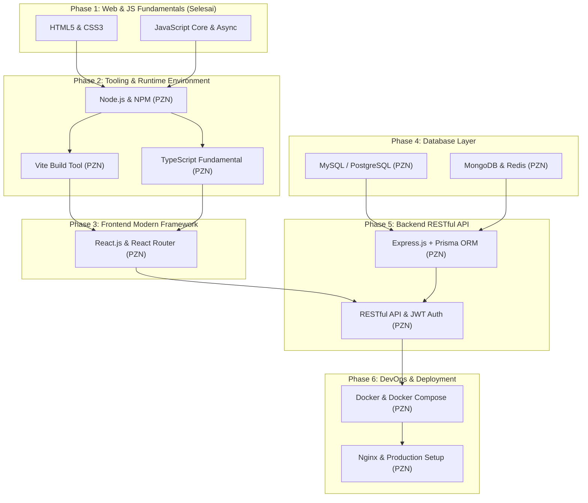

# 🚀 Full-Stack Web Developer Learning Roadmap & Syllabus

Selamat datang di **Roadmap Pembelajaran Full-Stack Web Developer**! Silabus ini disusun secara sistematis menggabungkan standar dari [roadmap.sh](https://roadmap.sh) dengan kurikulum video tutorial dari **[Programmer Zaman Now (PZN)](https://www.youtube.com/@ProgrammerZamanNow)**.

Silabus ini dilengkapi dengan *Progress Tracking Bar*, tautan langsung ke video playlist PZN, dan daftar periksa (*checkbox*) untuk memantau perkembangan belajar Anda.

---

## 📊 Progress Keseluruhan (Global Progress)

**Modul Selesai:** 1 / 7 Modul  
**Progress Keseluruhan:** `[█░░░░░░░░░] 14.3%`

*(Update status progress bar di atas secara berkala seiring dengan penyelesaian modul Anda).*

---

## 🔗 Referensi Sumber Belajar Utama (Programmer Zaman Now)

- 🌐 **Situs Resmi Roadmap PZN:** [programmerzamannow.com](https://programmerzamannow.com)
- 📺 **Channel YouTube PZN:** [Programmer Zaman Now YouTube](https://www.youtube.com/@ProgrammerZamanNow)
- 📑 **Daftar Playlist YouTube PZN:** [Programmer Zaman Now Playlists](https://www.youtube.com/@ProgrammerZamanNow/playlists)
- 🧭 **Standar Industri Web Dev:** [roadmap.sh/full-stack](https://roadmap.sh/full-stack)

---

## 🗺️ Ilustrasi Flowchart Silabus & Dependency Tree

Berikut adalah alur ketergantungan modul belajar (*prerequisite flow*) dari dasar hingga siap mengintegrasikan aplikasi Full-Stack:



---

## 📁 Struktur Folder Repositori Belajar (Rekomendasi Konsisten)

Agar repositori belajar ini tetap rapi dan terorganisir, gunakan struktur folder berikut:

```text
Learn-fullstack-web/
├── 01-web-js-fundamentals/      # Project & Latihan HTML, CSS, JS Async (Selesai)
├── 02-nodejs-npm-vite/          # Latihan Node.js, NPM Scripts, & Setup Vite
├── 03-typescript/               # Latihan TypeScript Compiler, Interfaces, & Generics
├── 04-reactjs/                  # Project React Component, Hooks, & React Router
├── 05-database/                 # Query MySQL, Script MongoDB, & Redis Caching
├── 06-backend-express-prisma/   # Project RESTful API Express.js + Prisma ORM + Auth
├── 07-devops-docker-nginx/      # Configuration Dockerfile, Docker Compose, & Nginx
└── README.md                    # Dokumentasi & Progress Tracking utama
```

---

## 📘 Modul 1: Web & JavaScript Fundamentals (Status: Selesai)
**Referensi:** [Roadmap JavaScript](https://roadmap.sh/javascript) | Referensi Kelas Dicoding ([Belajar JS](https://github.com/Xzavis/Belajar-Javascript-Dicoding.git) & [Final Assessment JS](https://github.com/Xzavis/Final-Assessment-JS.git))  
**Progress Modul 1:** `[██████████] 100%`

- [x] **1.1. HTML5 Fundamentals**
  - [x] Element Semantik (`header`, `nav`, `main`, `section`, `article`, `footer`)
  - [x] Form Validation & Input Types
  - [x] Web Accessibility (a11y) & Basic SEO Tags
- [x] **1.2. CSS3 & Responsive Layout**
  - [x] Box Model, Sizing, & Position
  - [x] Flexbox Layouting & CSS Grid
  - [x] Responsive Web Design (Media Queries, Mobile-first)
- [x] **1.3. JavaScript Core Basics**
  - [x] Syntax, Variabel (`var`, `let`, `const`), & Scope
  - [x] Tipe Data, Type Casting, & Coercion
  - [x] Operator, Control Flow (`if-else`, `switch`), & Looping
  - [x] Function Declaration, Arrow Function, & Higher-Order Function
  - [x] Data Structures (Array Methods `map`/`filter`/`reduce`, Object, Set, Map)
- [x] **1.4. Asynchronous JavaScript & DOM**
  - [x] Manipulasi DOM & Event Listeners
  - [x] Asynchronous Concepts (Callback, Event Loop)
  - [x] Promises & `async/await` Syntax
  - [x] Fetch API & Handling JSON Data

---

## 🛠️ Modul 2: Node.js & Tooling Ecosystem
**Referensi Roadmap:** [Roadmap Node.js](https://roadmap.sh/nodejs)  
**Video PZN:** [Playlist Tutorial Node.js Dasar](https://www.youtube.com/results?search_query=Programmer+Zaman+Now+Tutorial+NodeJS+Dasar) | [Playlist Tutorial NPM](https://www.youtube.com/results?search_query=Programmer+Zaman+Now+Tutorial+NodeJS+NPM) | [Video Tutorial Vite](https://www.youtube.com/results?search_query=Programmer+Zaman+Now+Tutorial+Vite)  
**Prasyarat:** JavaScript Async `[x]`  
**Progress Modul 2:** `[░░░░░░░░░░] 0%`

- [ ] **2.1. Node.js Core Basics**
  - [x] Pengenalan V8 Engine & Architecture Node.js
  - [] Global Objects (`process`, `console`, `Buffer`)
  - [ ] Module System: CommonJS (`require`) vs ES Modules (`import/export`)
  - [ ] Core Modules (`fs` File System, `path`, `events`, `os`, `http`)
- [ ] **2.2. Node Package Manager (NPM)**
  - [ ] Inisialisasi Project (`npm init`) & File `package.json`
  - [ ] Local vs Global Package Installation
  - [ ] Dependency Types (`dependencies` vs `devDependencies`)
  - [ ] Semantic Versioning (`^`, `~`) & Custom NPM Scripts
- [ ] **2.3. Build Tool Modern (Vite)**
  - [ ] Konsep Build Tool & Keunggulan Vite (ESbuild)
  - [ ] Inisialisasi Project Vite (`npm create vite@latest`)
  - [ ] Configuration & Environment Variables (`.env`, `import.meta.env`)
  - [ ] Production Bundling (`vite build`) & Local Server Preview (`vite preview`)

---

## 🔷 Modul 3: TypeScript Fundamental
**Referensi Roadmap:** [Roadmap TypeScript](https://roadmap.sh/typescript)  
**Video PZN:** [Playlist Tutorial TypeScript Dasar](https://www.youtube.com/results?search_query=Programmer+Zaman+Now+Tutorial+TypeScript+Dasar)  
**Prasyarat:** Node.js & NPM  
**Progress Modul 3:** `[░░░░░░░░░░] 0%`

- [ ] **3.1. Basic Data Types & Type System**
  - [ ] Primitive Data Types (`string`, `number`, `boolean`, `any`, `unknown`)
  - [ ] Array, Tuple, & Enum Types
  - [ ] Type Inference vs Explicit Type Annotations
- [ ] **3.2. Interfaces & Advanced Types**
  - [ ] Type Alias vs Interface Declaration
  - [ ] Optional Properties (`?`) & Readonly Properties
  - [ ] Union Types (`|`) & Intersection Types (`&`)
- [ ] **3.3. Functions & Generics**
  - [ ] Function Type Signatures & Default Parameters
  - [ ] Generic Functions & Generic Interfaces
  - [ ] Generic Constraints (`extends`)
- [ ] **3.4. TS Config & Compiler Setup**
  - [ ] Konfigurasi `tsconfig.json` & Options Utama
  - [ ] Strict Mode Options (`"strict": true`)
  - [ ] Process Kompilasi TypeScript ke JavaScript (`tsc`)

---

## ⚛️ Modul 4: Frontend Development dengan React.js
**Referensi Roadmap:** [Roadmap React](https://roadmap.sh/react)  
**Video PZN:** [Playlist Tutorial ReactJS Dasar](https://www.youtube.com/results?search_query=Programmer+Zaman+Now+Tutorial+ReactJS+Dasar) | [Tutorial React Router](https://www.youtube.com/results?search_query=Programmer+Zaman+Now+React+Router)  
**Prasyarat:** JS Async `[x]`, Node.js, Vite, TypeScript  
**Progress Modul 4:** `[░░░░░░░░░░] 0%`

- [ ] **4.1. React Core Architecture**
  - [ ] Konsep Virtual DOM & JSX Syntax
  - [ ] Functional Components & Component Composition
  - [ ] Props Passing & Read-only Props Rule
- [ ] **4.2. State & Event Handling**
  - [ ] State Management dengan `useState` Hook
  - [ ] Event Handling di React Elements
  - [ ] Controlled Components & Form Handling
  - [ ] Conditional Rendering & Rendering Lists (`key` prop)
- [ ] **4.3. React Hooks Mendalam**
  - [ ] `useEffect`: Managing Side Effects, Data Fetching, & Cleanups
  - [ ] `useRef`: Direct DOM Access & Mutable Values
  - [ ] `useContext`: Global State Management tanpa Prop Drilling
  - [ ] `useMemo` & `useCallback`: Performance Optimization
- [ ] **4.4. React Router & Data Fetching**
  - [ ] Setup `BrowserRouter`, `Routes`, & `Route`
  - [ ] Navigation dengan `Link` & `NavLink`
  - [ ] Dynamic Routing (`useParams`) & Programmatic Navigation (`useNavigate`)
  - [ ] Data Fetching dengan Axios / Fetch API & Loading/Error States

---

## 🗄️ Modul 5: Database System (Relational & NoSQL)
**Referensi Roadmap:** [Roadmap Databases](https://roadmap.sh/full-stack)  
**Video PZN:** [Playlist Tutorial MySQL Database](https://www.youtube.com/results?search_query=Programmer+Zaman+Now+Tutorial+MySQL+Database) | [Playlist Tutorial MongoDB Dasar](https://www.youtube.com/results?search_query=Programmer+Zaman+Now+Tutorial+MongoDB+Dasar) | [Tutorial Redis](https://www.youtube.com/results?search_query=Programmer+Zaman+Now+Tutorial+Redis)  
**Progress Modul 5:** `[░░░░░░░░░░] 0%`

- [ ] **5.1. Relational Database (MySQL / PostgreSQL)**
  - [ ] Konsep Database Relasional: Tabel, Primary Key, & Foreign Key
  - [ ] DDL Commands (`CREATE`, `ALTER`, `DROP`)
  - [ ] DML Commands (`SELECT`, `INSERT`, `UPDATE`, `DELETE`)
  - [ ] Relasi & JOIN Operations (`INNER JOIN`, `LEFT JOIN`, `RIGHT JOIN`)
  - [ ] Aggregate Functions, `GROUP BY`, & `HAVING`
  - [ ] Indexing, Database Transactions (`COMMIT`, `ROLLBACK`), & Normalisasi (1NF-3NF)
- [ ] **5.2. NoSQL Database (MongoDB)**
  - [ ] Document Database Architecture & Collection Concepts
  - [ ] CRUD Operations (`insertOne`, `find`, `updateOne`, `deleteOne`)
  - [ ] Query Filters & Operators
- [ ] **5.3. In-Memory Store & Caching (Redis)**
  - [ ] Key-Value Store Operations
  - [ ] Data Expiration (TTL - Time To Live)
  - [ ] Pola Caching Sederhana untuk Performa Data

---

## ⚡ Modul 6: Backend RESTful API & ORM
**Referensi Roadmap:** [Roadmap Backend](https://roadmap.sh/backend)  
**Video PZN:** [Playlist Belajar RESTful API](https://www.youtube.com/results?search_query=Programmer+Zaman+Now+Belajar+RESTful+API) | [Tutorial Express.js](https://www.youtube.com/results?search_query=Programmer+Zaman+Now+Tutorial+NodeJS+Express+JS) | [Tutorial Prisma ORM](https://www.youtube.com/results?search_query=Programmer+Zaman+Now+Prisma+ORM)  
**Prasyarat:** Node.js, TypeScript, Database  
**Progress Modul 6:** `[░░░░░░░░░░] 0%`

- [ ] **6.1. REST API Standards & Principles**
  - [ ] HTTP Methods (`GET`, `POST`, `PUT`, `PATCH`, `DELETE`)
  - [ ] HTTP Status Codes (200, 201, 400, 401, 403, 404, 500)
  - [ ] Request & Response Standard Headers & Body Contract
- [ ] **6.2. Express.js Framework**
  - [ ] Express Server Setup & Port Binding
  - [ ] Express Router & Routing Modular
  - [ ] Middleware Architecture (Built-in, Custom Error Handling, CORS)
- [ ] **6.3. Database Integration (Prisma ORM)**
  - [ ] Modeling Schema di `schema.prisma`
  - [ ] Database Migration (`npx prisma migrate`)
  - [ ] Prisma Client Query Operations & Handling Relations
- [ ] **6.4. Authentication & API Security**
  - [ ] Hashing Password dengan Bcrypt
  - [ ] JWT (JSON Web Token) Auth & Verification Middleware
  - [ ] Input Validation dengan Schema Validator (Joi / Zod)

---

## 🐳 Modul 7: DevOps, Containerization & Deployment
**Referensi Roadmap:** [Roadmap DevOps](https://roadmap.sh/devops)  
**Video PZN:** [Playlist Belajar Docker untuk Pemula](https://www.youtube.com/results?search_query=Programmer+Zaman+Now+Belajar+Docker+untuk+Pemula) | [Tutorial Nginx](https://www.youtube.com/results?search_query=Programmer+Zaman+Now+Tutorial+Nginx)  
**Prasyarat:** Application Frontend & Backend REST API  
**Progress Modul 7:** `[░░░░░░░░░░] 0%`

- [ ] **7.1. Docker Fundamentals**
  - [ ] Konsep Kontainerisasi vs Virtual Machine
  - [ ] Perintah Dasar Docker (`docker run`, `docker ps`, `docker stop`, `docker rm`)
  - [ ] Docker Image Management (`docker build`, `docker images`, `docker pull`)
- [ ] **7.2. Multi-Container & Dockerfile**
  - [ ] Membuat Custom `Dockerfile` (Node.js & React)
  - [ ] Multi-stage Builds untuk Penghematan Ukuran Image
  - [ ] Orchestration dengan `docker-compose.yml` (App + Backend + DB)
- [ ] **7.3. Nginx & Production Deployment**
  - [ ] Konfigurasi Nginx Server Block
  - [ ] Reverse Proxy Setup ke Node.js Backend App
  - [ ] Hosting Build Production React (`/dist`) melalui Nginx

---

## 📝 Catatan & Journal Belajar
*Gunakan bagian ini untuk mencatat ringkasan per modul atau kendala yang dihadapi saat praktik.*

- **Catatan Modul 1:** ...
- **Catatan Modul 2:** ...
- **Catatan Modul 3:** ...

> 💡 **Tips Belajar Programmer Zaman Now:**  
> Selalu buat project kecil setelah menyelesaikan 1 modul playlist untuk melatih pemahaman (*hands-on practice*).
